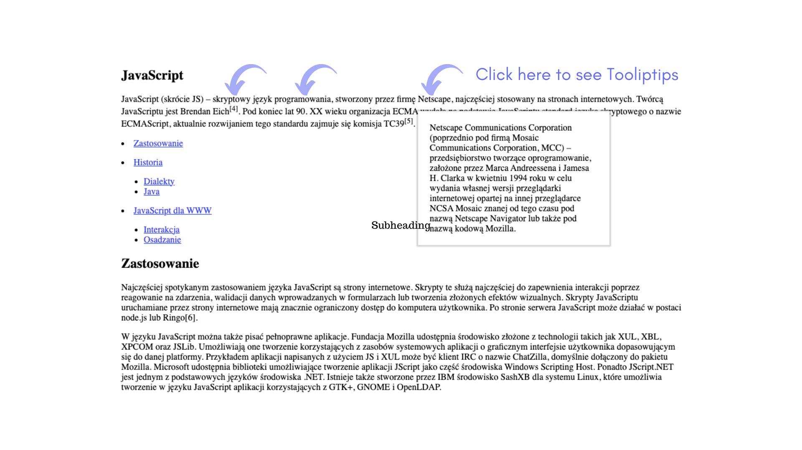

# Thanks for viewing my Project ✨

 

## :star: Demonstration of the Project: ([Dynamic Menu Tooltips JS](https://katarzynadworak.github.io/dynamic-menu-tooltips-js/))
 

## Main goal of my work was to:

**1. Dynamic Menu Creation**: develop a dynamic, multi-level menu system that can handle hierarchical data and render it appropriately in the DOM.

**2. Tooltip Enhancement**: implement a robust tooltip system that provides additional information or imagery when users hover over elements. 

**3. Efficient DOM Manipulation: use efficient techniques to manipulate the DOM**, ensuring high performance and a responsive user interface.

**4. Modular Code Structure**: create modular, reusable functions to enhance code readability, maintainability, and scalability.

**5. Interactive User Experience**: enhance user interaction with dynamic elements that respond to user actions, providing a seamless experience.

 

## Solutions provided in the project
**1. Dynamic Menu Creation:**
Example: Automatically generating nested lists based on a hierarchical data structure.

         const list = [
               { id: 1, parentId: null, text: 'Usage', link: '#Usage' },
               { id: 44, parentId: null, text: 'History', link: '#History' },
               { id: 7, parentId: 44, text: 'Dialects', link: '#Dialects' },
               { id: 31, parentId: 44, text: 'Java', link: '#Java' },
               { id: 24, parentId: null, text: 'JavaScript for WWW', link: '#JavaScript_for_WWW' },
               { id: 10, parentId: 24, text: 'Interaction', link: '#Interaction' },
               { id: 25, parentId: 24, text: 'Embedding', link: '#Embedding' }
         ];
         
         const ulElement = document.querySelector('.article__list');
         
         list.forEach(function(el) {
             if(el.parentId === null) {
                 createMenu(el, ulElement);
             }
         });
         
         const liElementList = ulElement.querySelectorAll('li');
         
         liElementList.forEach(function(parent) {
             const id = Number(parent.dataset.id);
             const children = list.filter(function(element) {
                 return element.parentId === id;
             });
         
             if(children.length > 0) {
                 const ulElement = document.createElement('ul');
                 children.forEach(function(child) {
                     createMenu(child, ulElement);
                 });
                 parent.appendChild(ulElement);
             }
         });
         
         function createMenu (el, parent) {
             const liElement = document.createElement('li');
             liElement.setAttribute('data-id', el.id);
             const aElement = document.createElement('a');
             liElement.appendChild(aElement);
             aElement.innerText = el.text;
             aElement.setAttribute('href', el.link);
             parent.appendChild(liElement);
         }
**2. Tooltip Enhancement:**
Example: Creating a tooltip system that provides both text and image tooltips.

         const tooltipList = document.querySelectorAll('span');
         
         tooltipList.forEach(function(element) {
             prepareTooltip(element);
         });
         
         function prepareTooltip(el) {
             const address = el.dataset.url;
             const type = el.dataset.tooltipType;
             const content = el.dataset.tooltipContent;
         
             createTooltipText(el, address, type, content);
         }
         
         function createTooltipText (el, address, type, content) {
             el.removeAttribute('data-url');
             el.removeAttribute('data-tooltip-type');
             el.removeAttribute('data-tooltip-content');
         
             const aElement = document.createElement('a');
             const spanElement = document.createElement('span');
             el.appendChild(aElement);
             el.appendChild(spanElement);
             
             aElement.setAttribute('href', address);
         
             if(type === 'text') {
                 spanElement.className = 'tooltip__box tooltip__box--text';
                 spanElement.innerText = content;
             } else if(type === 'image') {
                 spanElement.className = 'tooltip__box tooltip__box--image';
                 const imageElement = document.createElement('img');
                 spanElement.appendChild(imageElement);
                 imageElement.className = 'tooltip__image';
                 imageElement.setAttribute('src', content);
             }
         }
 
 

## 🛠️ Languages and Tools used: 

 
 
 
 

## :blue_heart:  You can find me on:
 

 
 

### Thanks
To my Mentor - devmentor.pl – for creating the task and for the code review.
